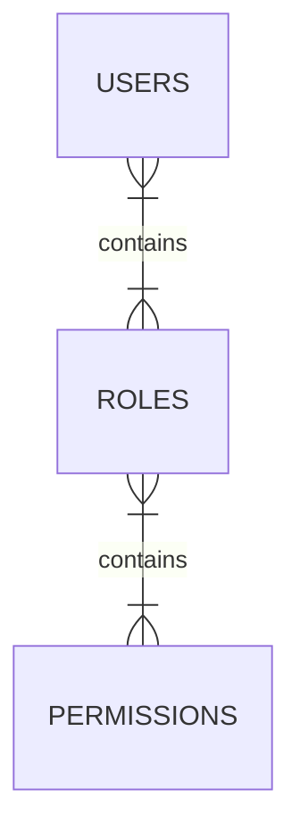

application with nodejs addressing authentication and authorization

## entity relationship diagram:



## Executing the Project

To run the project, use the following command:

```javascript

    npm run dev
```

## dependencies

-   [Prisma](https://www.prisma.io/)
-   [JWT](https://jwt.io)
-   [BCrypt](https://www.npmjs.com/package/bcrypt)
-   [JsonWebToken](www.npmjs.com/package/jsonwebtoken)
-   [tsyringe] (www.npmjs.com/package/tsyringe)

<h3 align="center">Desenvolvido por  Delano Almeida filho </h3>
